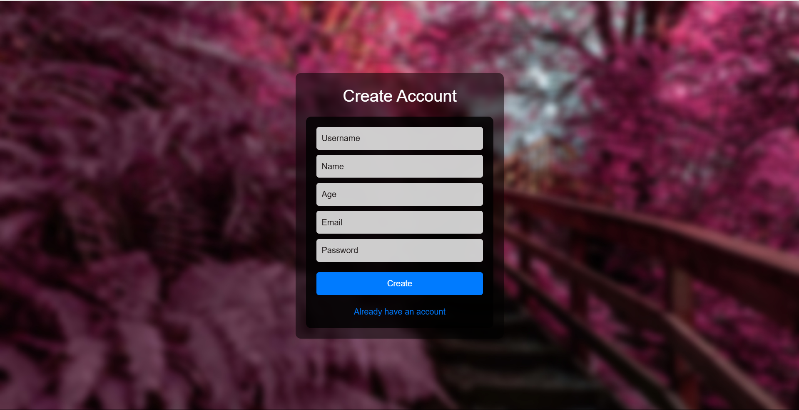
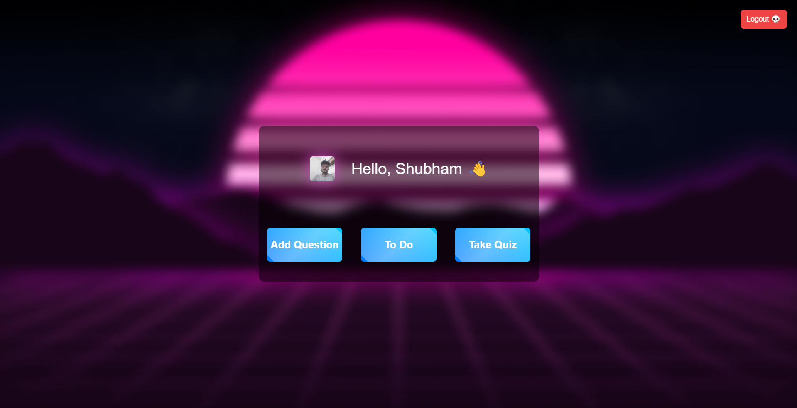
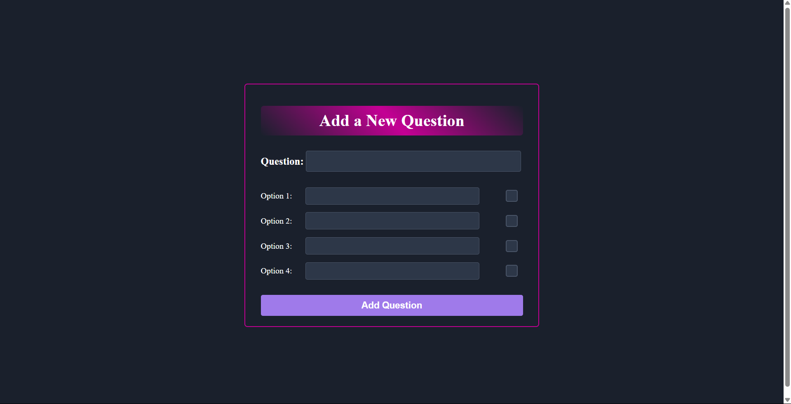
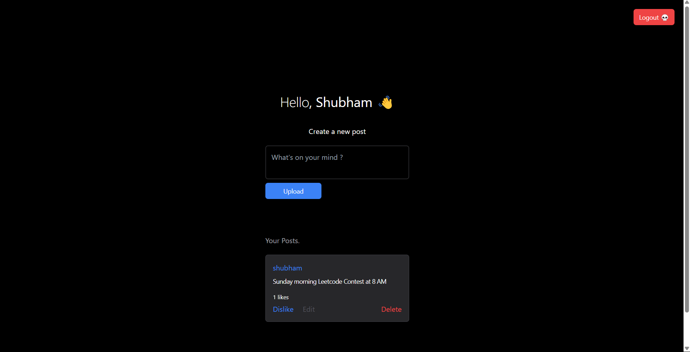
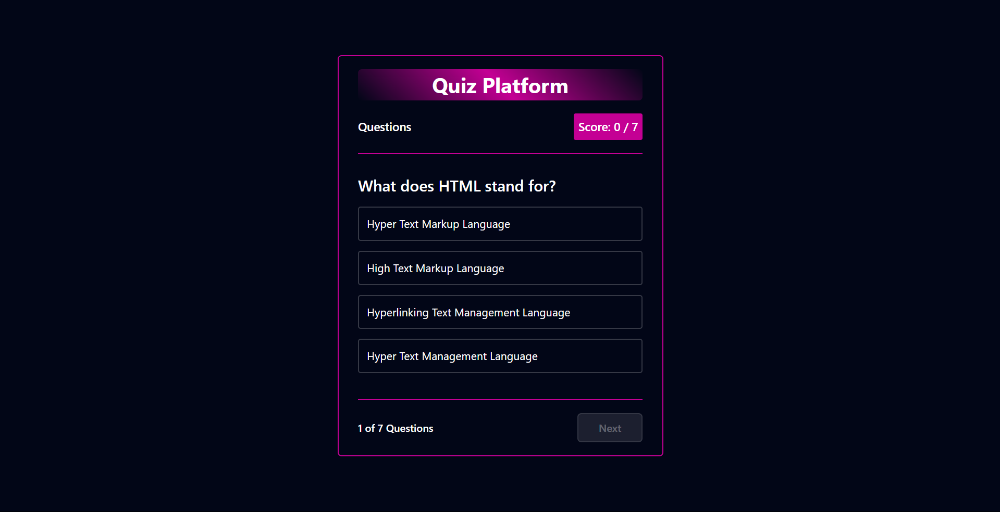
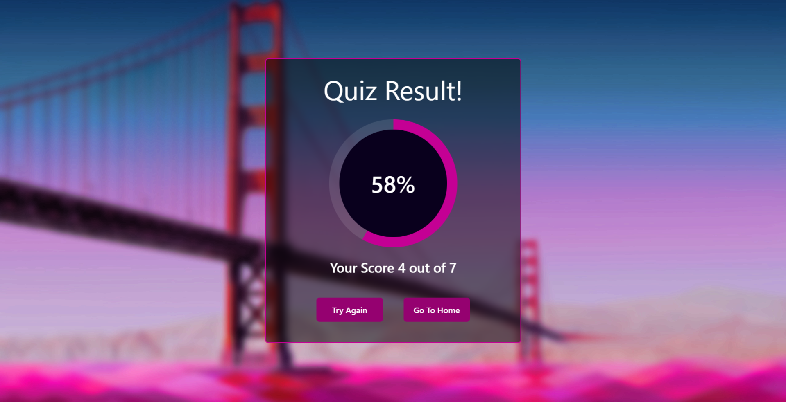

# Quiz App

A feature-rich Quiz Application built with **EJS** and **Express**, providing functionality for user authentication, secure password storage, and a variety of interactive features including taking quizzes, managing to-do notes, and adding custom questions.

[Live Demo](https://quiz-1j9d.onrender.com/)

---

## Overview
This project is a multi-functional Quiz Application that offers:
1. **Quiz Feature:** Users can take quizzes and see their results.
2. **To-Do Notes:** Users can add and manage personal notes.
3. **Add Questions:** Users can contribute new questions to the quiz.
4. **User Authentication:** Secure login and signup with hashed passwords.

---

## Features
- **Authentication:** Secure user authentication with password hashing using **bcryptjs**.
- **Quiz Management:** Interactive quizzes with real-time result updates.
- **To-Do Management:** Simple and efficient note management system.
- **Add Questions:** Users can expand the quiz database by submitting questions.
- **Responsive Design:** Optimized for all device sizes.

---

## Screenshots
### Signup Page:


### Home Page:


### Add Question:


### To-Do List:


### Take Quiz:


### Result:


---

## Technologies Used

### Backend
- **Express.js:** Framework for building server-side functionality.
- **EJS:** Template engine for rendering views.
- **Mongoose:** For database management and schema creation.
- **bcryptjs:** For password hashing.
- **jsonwebtoken:** For secure session handling.
- **Multer:** For handling file uploads.

### Hosting
- Hosted on Render: [Live Demo](https://quiz-1j9d.onrender.com/)

---

## Dependencies
```json
{
  "dependencies": {
    "bcrypt": "^5.1.1",
    "cookie-parser": "^1.4.6",
    "ejs": "^3.1.10",
    "express": "^4.19.2",
    "jsonwebtoken": "^9.0.2",
    "mongoose": "^8.4.3",
    "multer": "^1.4.5-lts.1",
    "nodemon": "^3.1.4"
  }
}
```

---

## Installation

### Prerequisites
- Node.js and npm installed.
- MongoDB database set up.

### Steps
1. Clone the repository:
   ```bash
   git clone https://github.com/your-username/quiz-app.git
   ```

2. Navigate to the project directory:
   ```bash
   cd quiz-app
   ```

3. Install dependencies:
   ```bash
   npm install
   ```

4. Configure environment variables:
   Create a `.env` file and add:
   ```env
   PORT=3000
   MONGO_URI=your_mongodb_connection_string
   JWT_SECRET=your_secret_key
   ```

5. Start the development server:
   ```bash
   npm start
   ```

6. Open your browser and navigate to:
   ```
   http://localhost:3000
   ```

---

## How It Works
1. **Authentication:** Users can sign up and log in. Passwords are securely hashed with bcryptjs.
2. **Quiz Flow:** Users can take quizzes, and results are displayed at the end.
3. **To-Do Notes:** Users can add and manage notes via the to-do feature.
4. **Add Questions:** New questions can be added to the quiz database.

---

## Future Improvements
- Add user profiles to store quiz history and to-do lists.
- Implement role-based access control for administrators.
- Enable file uploads for question media.
- Add time-based quizzes and leaderboards.

---

## License
This project is licensed under the MIT License. See the LICENSE file for details.

---

## Contribution
Contributions are welcome! Feel free to fork the repository and submit a pull request.

---

## Contact
For queries or feedback, please contact [Shubham](mailto:shubhamjaishu@gmail.com).
